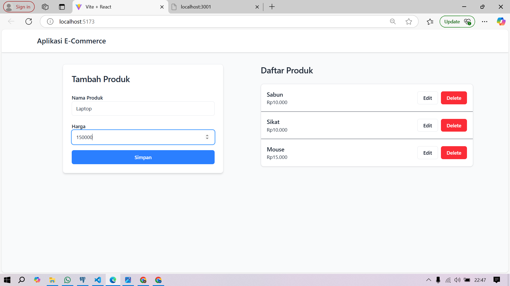
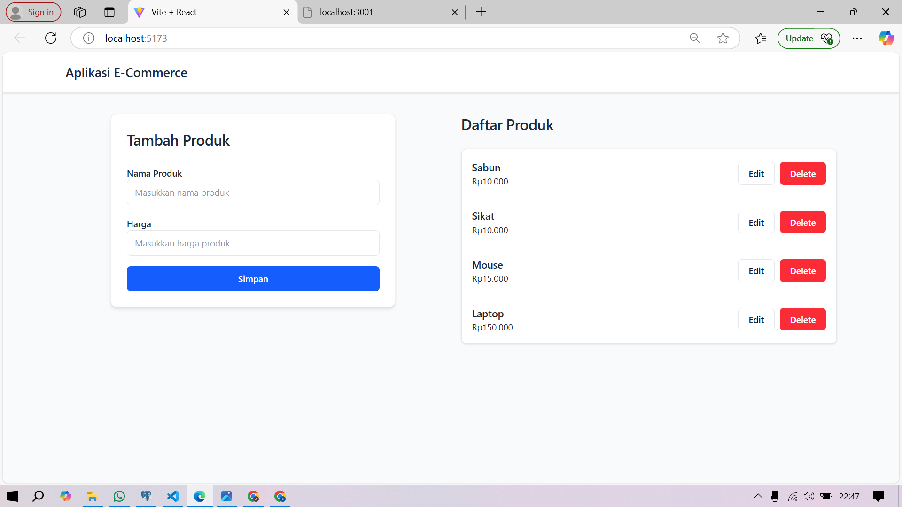
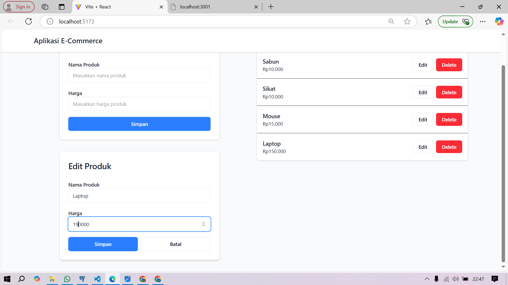
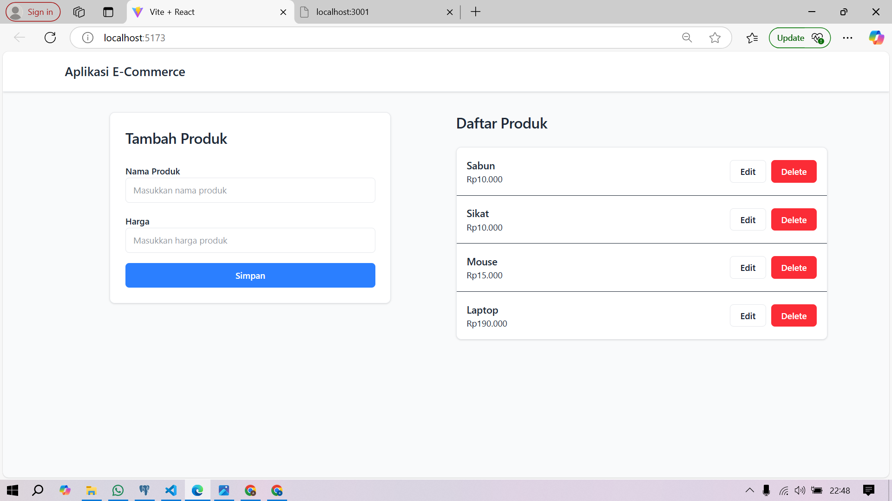
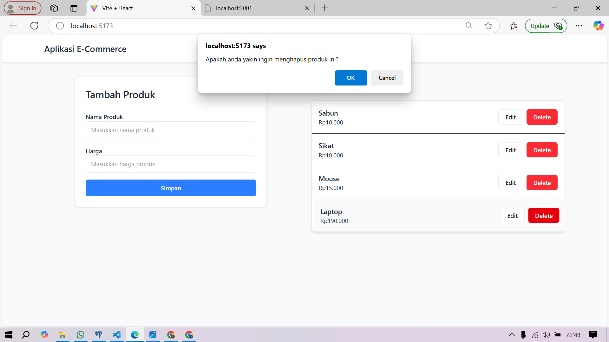
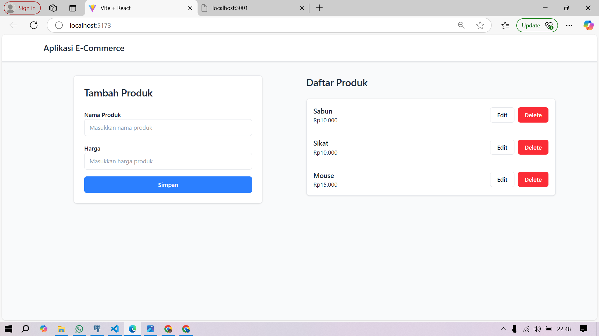

# **Aplikasi E-Commerce**

## 📂 Repository
Klik di sini untuk mengakses: https://github.com/Azizah66/bismillah.git

## 📝 **Deskripsi Proyek**
Aplikasi *E-Commerce Product Management System* adalah platform berbasis web yang memungkinkan pengelolaan produk secara efisien untuk kebutuhan e-commerce. Aplikasi ini dibangun menggunakan **React.js** di sisi frontend dan **Express.js** di sisi backend, menyediakan antarmuka modern untuk operasi **CRUD (Create, Read, Update, Delete)**.

## 🛠️ **Teknologi yang Digunakan**

### Frontend:
- React.js
- Tailwind CSS (untuk styling)
- Axios (untuk komunikasi dengan API)

### Backend:
- Express.js
- Node.js
- RESTful API

## 📋 **Prasyarat**
Sebelum menjalankan aplikasi ini, pastikan sistem Anda memiliki:

- **Node.js** (versi 14.0.0 atau lebih tinggi)
- **NPM** (Node Package Manager)
- **Browser modern** (Chrome, Firefox, atau Edge)

## 🚀 **Instalasi dan Menjalankan Aplikasi**

### 1. Clone Repository (Jika Diperlukan)
```bash
 git clone https://github.com/namauser/ecommerce-app.git
 cd ecommerce-app
```

### 2. Install Dependensi
```bash
npm install
```

### 3. Menjalankan Backend
```bash
node index.js
```
Server akan berjalan di `http://localhost:3001`

### 4. Menjalankan Frontend
```bash
npm run dev
```
Akses aplikasi di `http://localhost:5173` (atau port yang ditentukan di konfigurasi).

## **Struktur Proyek**
```
ecommerce-app/
├── backend/
│   ├── index.js
│   └── package.json
├── frontend/
│   ├── src/
│   │   ├── components/
│   │   │   ├── ProdukList.jsx
│   │   │   ├── TambahProduk.jsx
│   │   │   └── EditProduk.jsx
│   │   ├── App.jsx
│   │   └── main.jsx
│   └── package.json
└── README.md
```

## 📊 **API Endpoints**

### Base URL: `http://localhost:3001`

| Method  | Endpoint       | Deskripsi               |
|---------|----------------|--------------------------|
| **GET** | `/produk`      | Mengambil semua produk  |
| **GET** | `/produk/:id`  | Mengambil produk spesifik|
| **POST**| `/produk`      | Menambah produk baru    |
| **PATCH**| `/produk/:id` | Memperbarui produk      |
| **DELETE**| `/produk/:id`| Menghapus produk        |

### Contoh Request dan Response

#### 1. Mendapatkan Semua Produk
**Request:**
```bash
GET /produk
```

**Response:**
```json
[
  {
    "id": 1,
    "nama": "Sikat",
    "harga": 20000
  },
  {
    "id": 2,
    "nama": "Sabun",
    "harga": 10000
  }
]
```

#### 2. Menambah Produk Baru
**Request:**
```bash
POST /produk
```
```json
{
  "nama": "Mouse",
  "harga": 50000
}
```

**Response:**
```json
{
  "id": 3,
  "nama": "Mouse",
  "harga": 50000
}
```

## 📌 **Fitur Utama**

### 1. **Manajemen Produk**
- Menampilkan daftar produk dengan antarmuka modern.
- Terdapat badge untuk menghitung jumlah produk.
- Status ketersediaan produk terlihat jelas.


### 2. **Operasi CRUD Lengkap**

**➤ Penambahan Produk (Create)**
- Form input intuitif dan mudah digunakan.
- Validasi input secara real-time.



**➤ Melihat Produk (Read)**
- Menampilkan produk dalam daftar yang tertata rapi.
- Informasi produk lengkap dan mudah dibaca.



**➤ Pembaruan Produk (Edit)**
- Form edit dalam modal dengan data yang sudah terisi otomatis.
- Preview langsung perubahan sebelum disimpan.




**➤ Penghapusan Produk (Delete)**
- Konfirmasi penghapusan untuk mencegah kesalahan.
- Tampilan diperbarui secara otomatis setelah penghapusan.




## ✅ **Kesimpulan**

Setelah melalui pengujian menyeluruh, aplikasi ini terbukti memiliki:

1. Performa yang stabil tanpa error signifikan.
2. UX/UI modern yang ramah pengguna.
3. Kemampuan menangani berbagai kasus penggunaan.
4. Feedback yang jelas dan responsif kepada pengguna.

Seluruh fitur bekerja sesuai spesifikasi yang diharapkan, memberikan pengalaman pengelolaan produk yang efisien dan profesional.

## 🛠️ **Troubleshooting (Mengatasi Masalah Umum)**

1. **Server Tidak Bisa Berjalan:**
   - Pastikan port `3001` tidak sedang digunakan aplikasi lain.
   - Periksa instalasi **Node.js** dan **NPM**.

2. **Frontend Tidak Bisa Diakses:**
   - Jalankan `npm install` untuk memastikan semua dependensi terpasang.
   - Cek *console* di browser untuk melihat error yang terjadi.

3. **API Tidak Merespons:**
   - Pastikan backend berjalan di `http://localhost:3001`.
   - Periksa URL dan endpoint yang digunakan sesuai dokumentasi.

---